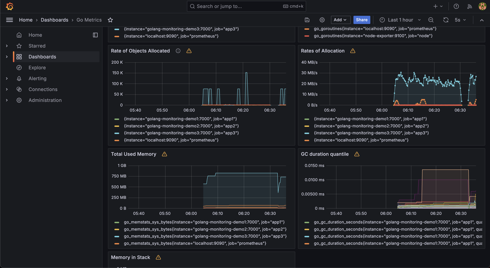

# Monitoring with Prometheus and Grafana

## Prerequisites

- Docker
- Docker compose
- Golang 1.22.2

## Setup

1. Clone this repository
    ```shell
    git clone git@github.com:GabiBizdoc/random.git
    cd random/grafana-dashboard
    ```
2. Create an external docker network
    ```shell
        docker network create monitoring
    ```
3. Start prometheus and grafana
    ```shell
    cd prometheus
    docker compose up -d
    ```
4. Start the applications
    ```shell
    cd main
    docker compose up -d --build
    ```
5. Add Dashboards

Once Grafana is up and running, it can be accessed at http://localhost:3000 (default credentials: admin/admin).

- Add Prometheus as a data source `http://prometheus:9090`
    - Menu -> Connections -> Data Source
    - **Add new data source**. Then choose Prometheus
    - In this case Prometheus server URL is `http://prometheus:9090` because everything is in the same network. So we
      can
      use the container name.
- Import dashboards
    - Menu -> Dashboards
    - New -> Import. Then Paste an id from below. Click **Load**. And then select your datasource (Prometheus)

## Dashboards

| ID    | Link                                                                                                |
|-------|-----------------------------------------------------------------------------------------------------|
| 1860  | https://grafana.com/grafana/dashboards/1860-node-exporter-full/                                     |
| 3662  | https://grafana.com/grafana/dashboards/3662-prometheus-2-0-overview/                                |
| 6671  | https://grafana.com/grafana/dashboards/6671-go-processes/                                           |
| 10826 | https://grafana.com/grafana/dashboards/10826-go-metrics/                                            |
| 2     | https://grafana.com/grafana/dashboards/2-prometheus-stats/                                          |
| 15172 | https://grafana.com/grafana/dashboards/15172-node-exporter-for-prometheus-dashboard-based-on-11074/ |

## Dashboard Preview


